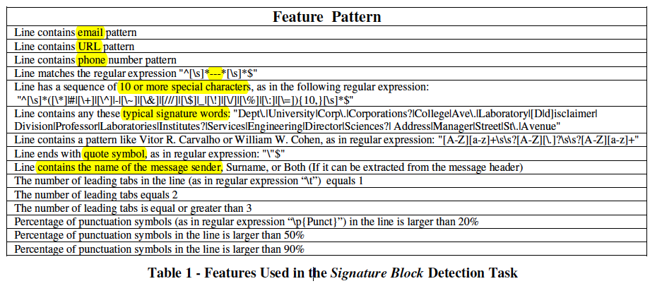
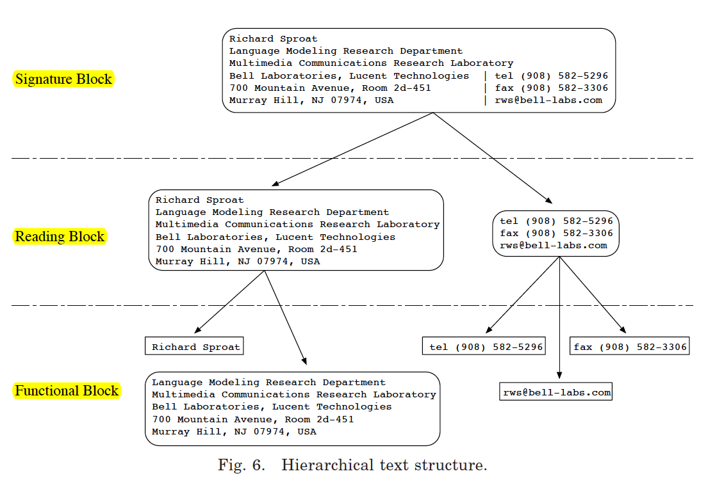
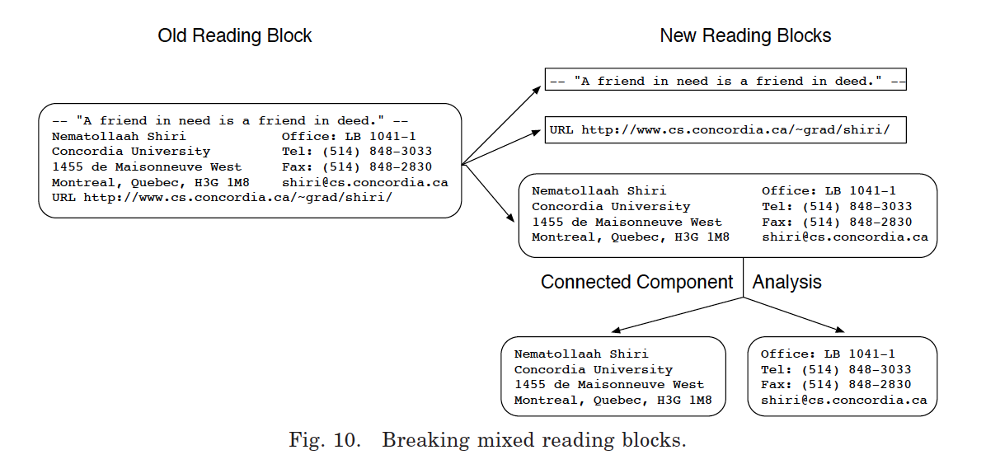
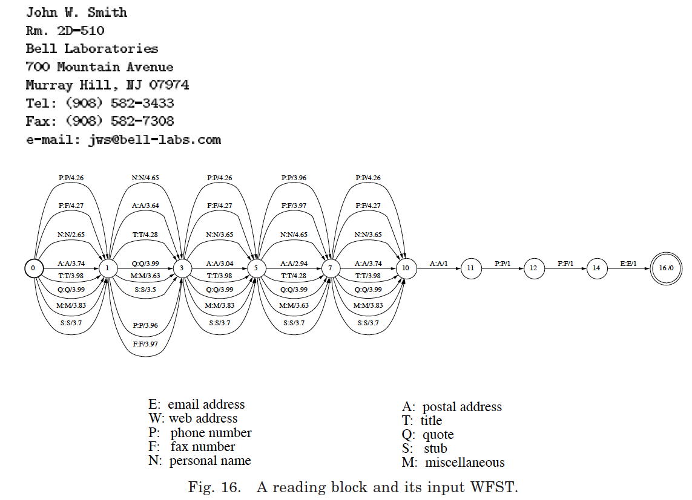

##Most Related Work 
 - **Year**-**Citation**-**Name**

1. 1998----28-----[EMU- AN-E-MAIL-PREPROCESSOR-FOR-TEXT-TO-SPEECH](http://ieeexplore.ieee.org/xpls/abs_all.jsp?arnumber=738941)
2. 1998----05-----[E-mail-Signature-Block-Analysis](http://ieeexplore.ieee.org/xpls/abs_all.jsp?arnumber=711900)
3. 1999----17-----[Integrating-Geometrical-and-Linguistic-Analysis-for-Email-Signature-Block-Parsing](http://dl.acm.org/citation.cfm?id=326442)
4. 2004----85-----[Learning-to-Extract-Signature-and-Reply-Lines-from-Email](http://www.cs.cmu.edu/~wcohen/postscript/email-2004.pdf)
5. 2007----68-----[Author Profiling for English Emails](http://hum.csse.unimelb.edu.au/pacling2007/pdf/PACLING200730.pdf)
6. 2009----16-----[Segmenting-Email-Message-Text-into-Zones](http://dl.acm.org/citation.cfm?id=1699632)
7. 2011----07-----[Automatically-Locating-Salutation-and-Signature-Blocks-in-Emails](http://ieeexplore.ieee.org/xpls/abs_all.jsp?arnumber=6019891&tag=1)
8. 2012----01-----[Interpreting-Contact-Details-out-of-E-mail-Signature-Blocks](http://dl.acm.org/citation.cfm?id=2188211)

- **Development**
  - [1] --> [2] (Part of [1]) <==> [3] (Detailed Version)
  - [4] uses ML, achiveing accuracy > 97%.
  - [5] finds they could not configure [4] to distinguish the more detailed categories. [4] also makes systematic errors and does not identify forwarded message text
  - [6] finds problems in [4]. Refine and extend categories in [5] to 9 zones. 
    - Data(old, homogeneous, different from contemporary, **not Enron**)
    - Didn't accurately identify forwarded or reply content in email data from the
Enron email corpus
 - [7] argues [3] unsatisfactory in accuracy, [4]'s  efficiency isn’t high when the methods are applied to a large email corpus.

- **Open-Source Project**
 - a related open-source project using Python called [Talon](https://github.com/mailgun/talon)

- **Performance**
 - [1,2,3] Identification is evaluated on __347__ e-mail messages. 
__Recall: 53% (97/183).__ (Among the 86 errors, 79 are trivial one-line signatures such as “-John” or “-J”. When excluding these, the recall becomes __93%(97/104).__ 
__Precision: 90%(97/108).__
 - [4] __Accuracy__ (above __99%__) and _F1_ measures (nearly __97%__) were achieved
 - [5] document parser achieved an **accuracy** of **88.16%** while [4] performed at **64.22%**. When focusing on the task of identifying only author lines, [5] reached an **F-score** of **90.76%** compared to **74.64%** from [4].
 - [6] achieves **accuracy** of **87.01%**, when the number of zones is abstracted to 2 or 3 zone classes, this increases to **93.60%** and **91.53%** respectively on **Enron**.
 - [7] Results on the public subset of the **Enron** corpus get **average F1 value** above **90%**

## Details
### Signature Extraction Method
- [1,2,3] 
  - Parse each line into different functional class
  - Differentiate them according to the features of different block. 
  - For Signature parts, they usually have Email, URL, Phone Numbers, Miscs ect, once the portion of these parts exceed one threshould, they are marked as Sig.

- [4] 
  - For each user, find last K lines which are identiccal for most of the emails.
  - An email message is represented by a set of features, and a classifier is
learned over this feature space.

- [5]
  - Builds a statistical model of document structure by extracting features from each line of a document and using them to train a statistical classifier.(using Conditional Random Fields modle)
  - Classify the body text in an email document into 5 categories(Author text, Signature, Advertisement, Quoted, Reply).

- [6] 
  - Classify into 3 big zones. (Boundaries.)
  - Classify each line for each zone using different features. 
    - Graphic: number of workds, line length
    - Orthographic: start with '>', has URL
    - Lexical Features: contain senders' name, initials, recipients.
- [7]
 -  Remove the quoted part from the email body. 
 -  Exploiting a statistical method to roughly decide salutation and signature blocks
 -  Introducing some restriction rules to decide the exact lines belonging to salutation and signature blocks.

-

### Signature Parsing 
 -		 
 -		
 -

