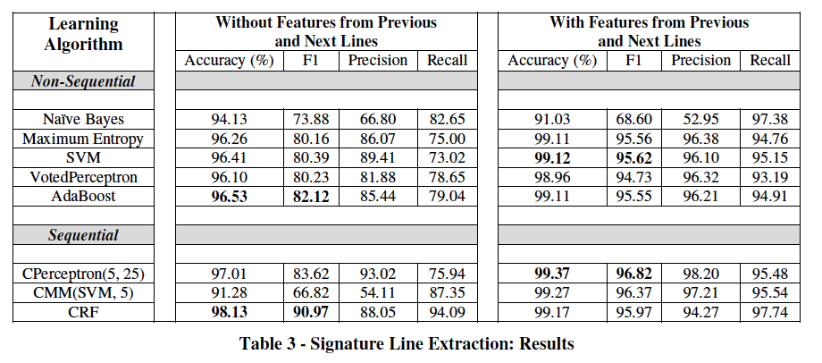

# Email Signature

##Related Work 
 - **Year**-**Citation**-**Name**

1. 1998----28-----EMU- AN-E-MAIL-PREPROCESSOR-FOR-TEXT-TO-SPEECH
2. 1998----05-----E-mail-Signature-Block-Analysis
3. 1999----17-----Integrating-Geometrical-and-Linguistic-Analysis-for-Email-Signature-Block-Parsing
4. 2004----85-----Learning-to-Extract-Signature-and-Reply-Lines-from-Email
5. 2009----16-----Segmenting-Email-Message-Text-into-Zones
6. 2011----07-----Automatically-Locating-Salutation-and-Signature-Blocks-in-Emails
7. 2012----01-----Interpreting-Contact-Details-out-of-E-mail-Signature-Blocks

- **Development**
  - 1 --> 2 (Part of 1) <==> 3 (Detailed Version)
  - 4 Using ML, has a related open-source project using Python called [Talon](https://github.com/mailgun/talon)

## Details
### Signature Extraction
1. Parser Method
  - Parse each line into different functional class
  - Differentiate them according to the features of different block. 
  - For Signature parts, they usually have Email, URL, Phone Numbers, Miscs ect, once the portion of these parts exceed one threshould, they are marked as Sig.

2. ML Method
  - For each user, find last K lines which are identiccal for most of the emails.
  - An email message is represented by a set of features, and a classifier is
learned over this feature space.

### Signature Parsing

##Performance
###Overview
- [1,2,3] Identification is evaluated on __347__ e-mail messages. 
__Recall: 53% (97/183).__ (Among the 86 errors, 79 are trivial one-line signatures such as “-John” or “-J”. When excluding these, the recall becomes __93%(97/104).__ 
__Precision: 90%(97/108).__
- [4] __Accuracy__ (above __99%__) and _F1_ measures (nearly __97%__) were achieved

